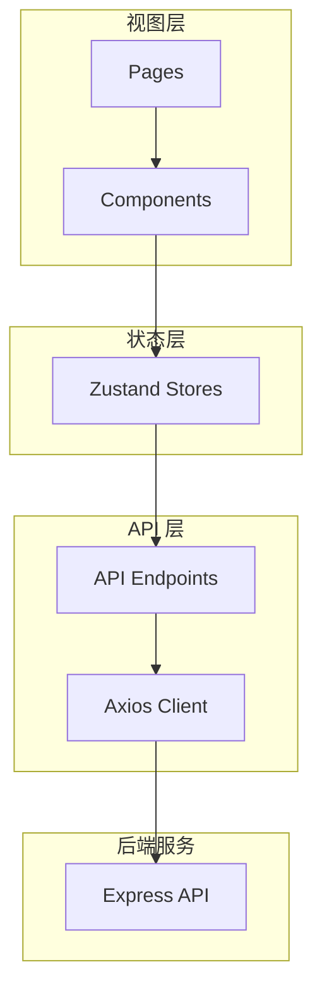

# CC-Toolify 前端重构计划

## 1. 技术选型

### 核心栈
- **构建工具**: Vite 6.x - 极速的开发体验和构建速度
- **框架**: React 19.x + TypeScript 5.x - 类型安全、组件化开发
- **样式**: Tailwind CSS 4.x - 原子化 CSS，快速开发
- **UI 组件**: shadcn/ui - 高质量的 React 组件库
- **状态管理**: Zustand 5.x - 轻量级、TypeScript 友好
- **路由**: React Router 7.x - 声明式路由管理
- **HTTP 客户端**: Axios - 统一的 API 请求处理
- **图标**: Lucide React - 现代化图标库

### 开发工具
- ESLint + Prettier - 代码规范
- TypeScript 严格模式 - 类型安全
- Vite 插件: @vitejs/plugin-react-swc - 更快的编译

## 2. 项目结构

```
web/
├── public/                    # 静态资源
│   └── favicon.ico
├── src/
│   ├── api/                   # API 客户端层
│   │   ├── client.ts          # Axios 实例配置
│   │   ├── auth.ts            # 认证相关 API
│   │   ├── providers.ts       # 上游服务 API
│   │   ├── mappings.ts        # 模型映射 API
│   │   └── logs.ts            # 日志 API
│   ├── components/            # 组件目录
│   │   ├── ui/                # shadcn/ui 组件
│   │   ├── layout/            # 布局组件
│   │   │   ├── MainLayout.tsx
│   │   │   ├── Header.tsx
│   │   │   └── Sidebar.tsx
│   │   ├── providers/         # 上游服务相关组件
│   │   │   ├── ProviderForm.tsx
│   │   │   ├── ProviderList.tsx
│   │   │   └── ProviderCard.tsx
│   │   ├── mappings/          # 模型映射相关组件
│   │   │   ├── MappingForm.tsx
│   │   │   ├── MappingList.tsx
│   │   │   └── MappingCard.tsx
│   │   ├── logs/              # 日志相关组件
│   │   │   ├── LogList.tsx
│   │   │   ├── LogFilter.tsx
│   │   │   └── LogDetail.tsx
│   │   └── common/            # 通用组件
│   │       ├── StatCard.tsx
│   │       ├── Loading.tsx
│   │       └── ErrorBoundary.tsx
│   ├── hooks/                 # 自定义 Hooks
│   │   ├── useAuth.ts
│   │   ├── useProviders.ts
│   │   ├── useMappings.ts
│   │   └── useLogs.ts
│   ├── stores/                # Zustand 状态管理
│   │   ├── authStore.ts
│   │   ├── providerStore.ts
│   │   ├── mappingStore.ts
│   │   └── logStore.ts
│   ├── types/                 # TypeScript 类型定义
│   │   ├── api.ts             # API 相关类型
│   │   ├── models.ts          # 数据模型类型
│   │   └── index.ts
│   ├── lib/                   # 工具函数
│   │   ├── utils.ts
│   │   └── constants.ts
│   ├── pages/                 # 页面组件
│   │   ├── LoginPage.tsx
│   │   ├── DashboardPage.tsx
│   │   ├── ProvidersPage.tsx
│   │   ├── MappingsPage.tsx
│   │   └── LogsPage.tsx
│   ├── App.tsx                # 根组件
│   ├── main.tsx               # 入口文件
│   └── index.css              # 全局样式
├── index.html
├── package.json
├── tsconfig.json
├── vite.config.ts
├── tailwind.config.ts
└── components.json            # shadcn/ui 配置
```

## 3. 架构设计

### 3.1 数据流架构



### 3.2 状态管理设计

每个 Store 独立管理自己的状态：

- **authStore**: 登录状态、用户信息、token 管理
- **providerStore**: 上游服务列表、当前编辑项、加载状态
- **mappingStore**: 模型映射列表、当前编辑项、加载状态
- **logStore**: 日志列表、筛选条件、分页

### 3.3 API 层设计

统一的 API 客户端配置：
- 基础 URL 配置
- 请求/响应拦截器
- 统一的错误处理
- 自动 token 注入

### 3.4 组件设计原则

1. **单一职责**: 每个组件只做一件事
2. **Props 驱动**: 通过 props 传递数据，避免直接访问 store
3. **组合优先**: 使用组合而非继承
4. **类型安全**: 所有组件都有明确的 TypeScript 类型

## 4. 页面设计

### 4.1 登录页 (/login)
- 简洁的登录表单
- 密码输入框
- 错误提示
- 登录状态持久化

### 4.2 Dashboard 页 (/)
- 统计卡片网格
  - 上游节点数量
  - 映射规则数量
  - 近期成功数
  - 近期失败数
- 快速导航到各功能模块

### 4.3 上游服务页 (/providers)
- 左侧: 添加/编辑表单
- 右侧: 上游服务列表
- 每个卡片: 编辑、删除、测试按钮

### 4.4 模型映射页 (/mappings)
- 左侧: 添加/编辑表单
- 右侧: 映射列表
- 每个卡片: 编辑、删除、测试按钮

### 4.5 请求日志页 (/logs)
- 筛选按钮组 (全部/处理中/成功/失败)
- 日志列表
- 展开查看详情

## 5. 样式设计

### 5.1 颜色系统
使用 Tailwind CSS 的 slate 色系作为基础：
- 背景: slate-50
- 卡片: white
- 主色: teal-600
- 次色: blue-600
- 成功: green-500
- 警告: yellow-500
- 错误: red-500

### 5.2 布局系统
- 最大宽度: 1280px
- 卡片圆角: rounded-xl (12px)
- 间距系统: 4px 基础单位
- 响应式: 移动端优先

### 5.3 组件风格
- 玻璃态效果: backdrop-blur
- 柔和阴影: shadow-sm / shadow-md
- 悬停效果: hover:shadow-lg

## 6. 迁移策略

### 阶段一: 基础搭建
1. 初始化 Vite + React 项目
2. 配置 Tailwind CSS
3. 安装 shadcn/ui
4. 配置 ESLint + Prettier

### 阶段二: 核心功能
1. 实现 API 客户端层
2. 实现状态管理 Store
3. 实现登录功能
4. 实现 Dashboard

### 阶段三: 业务功能
1. 实现上游服务管理
2. 实现模型映射管理
3. 实现日志查看

### 阶段四: 优化部署
1. 优化构建配置
2. 配置 Docker 构建
3. 更新后端静态文件服务
4. 移除旧 admin.html

## 7. 后端适配

需要修改 [`src/index.ts`](src/index.ts:147) 中的静态文件服务：

```typescript
// 从
app.get("/admin", (_request, response) => {
  response.sendFile(path.resolve(process.cwd(), "public", "admin.html"));
});

// 改为
app.use("/admin", express.static(path.resolve(process.cwd(), "web/dist")));
app.get("/admin/*", (_request, response) => {
  response.sendFile(path.resolve(process.cwd(), "web/dist/index.html"));
});
```

## 8. 预期收益

1. **开发效率提升**: 组件化开发，代码复用
2. **类型安全**: TypeScript 减少运行时错误
3. **维护性提升**: 清晰的代码结构和模块划分
4. **用户体验**: 更快的加载速度，更流畅的交互
5. **可扩展性**: 易于添加新功能
6. **现代化**: 使用最新的前端技术栈
